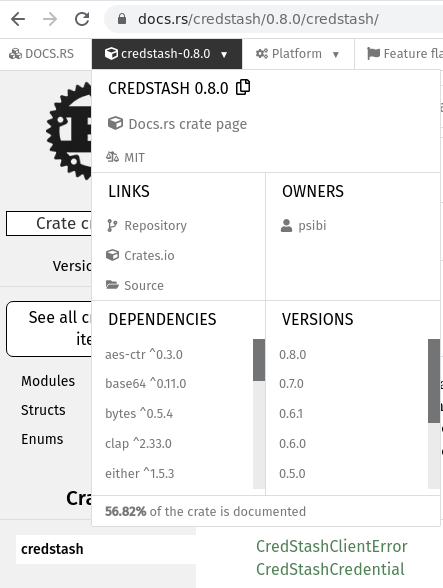

## Credstash

Credstash is a cli utility for managing credentials securely in AWS
cloud. It uses a combination of AWS Key Management Service (KMS) and
DynamoDB to achieve it. One of my co-worker has written a more
[detailed tutorial](https://www.fpcomplete.com/blog/2017/08/credstash)
here. The original tool was written by a company named
[Fugue](https://github.com/fugue/credstash) in Python. It has been
implemented in [various
languages](https://github.com/fugue/credstash#compatibility-with-other-languages)
including Rust which I have authored (Rucredstash).

## Release v0.8.0

I released a new version of
[rucredstash](https://github.com/psibi/rucredstash/releases/tag/v0.8.0)
quite some time ago and with that, *rucredstash* cli executable
becomes a drop in replacement to the original credstash program. While
you could use it previously too, it lacked the *putall*
subcommand. This subcommand had three different ways of passing data
to it:

### Passing data via file

You can pass the input from a file using the special symbol `@` to
indicate that the data is fed from the file:

``` shellsession
$ bat secrets.json
───────┬────────────────────────────────────────
       │ File: secrets.json
───────┼────────────────────────────────────────
   1   │ {
   2   │     "hello": "world",
   3   │     "hi": "bye"
   4   │ }
───────┴────────────────────────────────────────
$ rucredstash putall @secrets.json
hello has been stored
hi has been stored
```

### Passing data via stdin

You can also pass the data via stdin using the special operator `-`:

``` shellsession
$ rucredstash putall -
{ "hello": "world" }
hello has been stored
```

You have to press the [Return
key](https://en.wikipedia.org/wiki/Enter_key "Enter key") to indicate
that you have finished passing the data.

### Passing data directly

Or can you just pass the data as an explicit command line argument:

``` shellsession
$ rucredstash putall '{"hello":"world","hi":"bye"}'
hello has been stored
hi has been stored
```

I disliked the above overloaded behavior and wanted to give a
~~different~~ better user experience in my Rust implementation. But
that meant breaking compatibility with the original program. So, I
finally bit the bullet and implemented it. With that, it becomes a
drop in replacement to the original Python program which was my
primary goal when I started working on rucredstash.

## Future improvements

With v0.8.0 of rucredstash released, I still think there are lots of
improvements which can be done. Some of them are:

* Integrate [clippy](https://github.com/rust-lang/rust-clippy) to the CI.
* While the [library
  module](https://github.com/psibi/rucredstash/blob/c315f1428dfd02b143eb9404fe08b9f37d41ccf7/src/lib.rs#L1)
  is completely panic free, I think the [CLI
  driver](https://github.com/psibi/rucredstash/blob/master/src/main.rs)
  still has scope for improvement. There are several places where I'm
  using
  [expect](https://doc.rust-lang.org/std/option/enum.Option.html#method.expect)
  method which needs to be fixed. It shouldn't be hard IMO. :-)
* Add a new subcommand for `setup`. Something along the line of `setup
  cmk` probably which should setup the [Customer master
  key](https://docs.aws.amazon.com/kms/latest/developerguide/concepts.html#master_keys). Note
  that this functionality isn't present in the original credstash
  program.
* Experiment with structopt crate and see how it goes!

I should create a github issues for all the above points.

## Comparing Rust with Haskell

Now that I have *some* experience with Rust and have been working on
it for a couple of years or so, I would like to compare it with the
other language I prefer: Haskell. My primary language at work and
hobby is Haskell. I mainly want to compare Rust with Haskell in terms
of library quality, community and documentation. Note that my
experience is based on writing and maintaining *rucredstash* and also
doing some other minor work on Rust. Also, my codebase isn't that big
so probably my view would change based on more experience.

``` shellsession
$ cloc src tests/
       5 text files.
       5 unique files.
       0 files ignored.

github.com/AlDanial/cloc v 1.74  T=0.01 s (382.4 files/s, 170528.1 lines/s)
-------------------------------------------------------------------------------
Language                     files          blank        comment           code
-------------------------------------------------------------------------------
Rust                             4            149            123           1918
Bourne Shell                     1             13              0             27
-------------------------------------------------------------------------------
SUM:                             5            162            123           1945
-------------------------------------------------------------------------------
```

So it's roughly around 2000 Rust source lines. My initial code was
based on futures as [rusoto crate](https://crates.io/crates/rusoto)
which I use to interact with the AWS APIs didn't support async/await
yet. And that was pretty ugly. But once the crate supported
async/await, the migration was smooth and the new code was much
simpler to write and read.

I find the Rust community to be quite active and responsive. It was
easy for me to
[contribute](https://github.com/rusoto/rusoto/pull/1649/files) to
it. I find that there is a cultural difference between the Rust and
the Haskell community. In Haskell, there is no consensus if using
[Default
typeclass](https://www.reddit.com/r/haskell/comments/5gospp/dont_use_typeclasses_to_define_default_values/)
is a good idea. As compared to this, Rust provides a [Default
trait](https://doc.rust-lang.org/std/default/trait.Default.html) in
the standard library itself. In fact, Rust's [lint
checker](https://github.com/rust-lang/rust-clippy) suggested me to use
that in one of the places!

Let's compare the libraries in Rust and Haskell for doing the same
task. Let me pick two equivalent (or close to equivalent!) libraries
from both the languages:

<table class="table">
  <thead>
    <tr>
      <th scope="col">Task</th>
      <th scope="col">Haskell Library</th>
      <th scope="col">Rust Library</th>
    </tr>
  </thead>
  <tbody>
    <tr>
      <th scope="row">CLI</th>
      <td>[optparse-applicative](https://github.com/pcapriotti/optparse-applicative)</td>
      <td>[clap](https://github.com/clap-rs/clap)</td>
    </tr>
    <tr>
      <th scope="row">AWS API</th>
      <td>[amazonka](https://github.com/brendanhay/amazonka)</td>
      <td>[rusoto](https://github.com/rusoto/rusoto)</td>
    </tr>
  </tbody>
</table>

Compared to Haskell's optparse-applicative, my experience with clap
was that I had to write a lots of boilerplate code to parse the value
from
[ArgMatches](https://docs.rs/clap/2.33.3/clap/struct.ArgMatches.html). One
of my co-workers mentioned to me that I should use
[structopt](https://github.com/TeXitoi/structopt) to avoid that. Also,
there are various method in the clap crate like
[conflicts_with](https://docs.rs/clap/2.33.3/clap/struct.Arg.html#method.conflicts_with),
[requires](https://docs.rs/clap/2.33.3/clap/struct.Arg.html#method.requires)
and the related method which is quite nice. In my experience,
expressing that kind of relationship using optparse-applicative is
quite hard and the reason I guess is technical (optparse-applicative
being based on Applicative).

I think comparing amazonka with rusoto is unfair. Mostly because
amazonka is
[unmaintained](https://github.com/brendanhay/amazonka/issues/574). But
even [Rusoto](https://github.com/rusoto/rusoto/issues/1651) is in
maintenance mode now. I guess it's just hard to maintain wrapper for
AWS APIs! But AWS has released [an alpha
launch](https://aws.amazon.com/blogs/developer/a-new-aws-sdk-for-rust-alpha-launch/)
of an official Rust SDK. So in future we might even see a full blown
Rust wrapper from them.  My experience of building amazonka package is
that it takes huge amount of memory to build. In fact,
[amazonka-ec2](https://github.com/brendanhay/amazonka/issues/549)
needs around 7GB of memory. I dread every time a CI job tries to build
it without having a cache. I have had a much better experience with
Rusoto's compile times comparatively.

Let's compare optparse-applicative library. An [issue was opened in
2014](https://github.com/pcapriotti/optparse-applicative/issues/118)
on the optparse-applicative repository regarding supporting options
via environment variables. A similar [issue was opened in
2017](https://github.com/clap-rs/clap/issues/814) on clap and a [PR
for that](https://github.com/clap-rs/clap/pull/1062) was merged in the
same year. But compared to this, there is no such feature implemented
for optparse-applicative yet.

Also, the documentation of Rust libraries is in general top
notch. Although there has been recent efforts in the Haskell community
to improve the base docs, the Rust standard library is way ahead.  The
[Rust book](https://doc.rust-lang.org/book/) is really nice and makes
it easy to learn the language itself. The crate platform encourages
writing more documentation by displaying coverage statistics in the
page:



That being said, I should note that Rust and Haskell are different
languages with different trade offs. It would be unfair to compare
them on a purely language basis. (Although I feel this [blog
post](https://www.fpcomplete.com/blog/2018/11/haskell-and-rust/) does
a nice job of comparing them!). One part of the Rust language which
I'm starting to prefer is error handling. It's much easier to
understand than Haskell's exception mechanism. Doing safe [exception
handling](https://www.fpcomplete.com/haskell/tutorial/exceptions/) in
Haskell isn't easy and with the presence of async exceptions things
get more complicated. You don't have to deal with such issues in Rust
as errors are modeled via enum type and you can use the `?` operator
to easily propagate it. Also this will likely make the FFI integration
story much easier. I still prefer the convenience of using Haskell
when I'm okay using a garbage collector.

This kind of summarizes my experience with Rust as a Haskell
programmer. I'm planning to reach out more to Rust in future!
