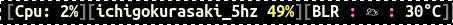
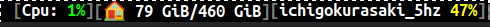
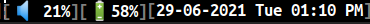

## Introduction

Cnx is a simple, yet powerful X11 status bar which can be used with
window managers. It gets the data from generic properties defined in
[Extended Window Manager
Hints](https://en.wikipedia.org/wiki/Extended_Window_Manager_Hints).

It's last release happened 2 years ago and I started working on it
around 6 months ago.

## Why Cnx

We have various X11 status bar like [xmobar](https://github.com/jaor/xmobar), [polybar](https://github.com/polybar/polybar) etc. But
the reason I got interested in Cnx was:

- I wanted something simple, efficient and resource friendly.
- I wanted the source program to be either written in Haskell or Rust
  as these are the languages I'm most comfortable with.

Note that I had been using Xmobar for more than five years, but I
was not very happy with it's performance. I did attempt to improve
it and you can find more details about this in my other [blog
post](https://psibi.in/posts/2020-06-16-xmobar-zurihac.html).

But despite the above work, I was not able to see significant
improvement even if I used a single optimized widget in my Xmobar
setup. This led me to believe that there is some overhead within
Xmobar itself. The reason for this is the not so efficient event
loop in Xmobar (despite the excellent work done by
[liskin](https://github.com/liskin) on optimizing it). To give you a
rough idea, this is my CPU consumption time when using Xmobar for
around 9 hours:

``` sh
USER       PID %CPU %MEM    VSZ   RSS TTY      STAT START   TIME COMMAND
sibi      3795  0.6  0.1 1076208404 34036 ?    Sl   10:38   4:10 sibi-xmobar
```

The **TIME** column above indicates the cumulative CPU time used by
the process. In this case, Xmobar took a total time of 4 minutes and
10 seconds.

And similar statistics when using Cnx with a similar set of widgets:

``` sh
USER       PID %CPU %MEM    VSZ   RSS TTY      STAT START   TIME COMMAND
sibi      5549  0.0  0.0 1191672 23740 tty1    Sl   09:17   0:11 cnx
```

So that's a huge time difference but xmobar's performance is good
enough and it may not be worth worrying too much about it. I would
also like to mention the caveat that Cnx is quite young and it has
lesser number of widgets available compared to Xmobar. It could
possibly have more bugs too. :-)

There is also [i3status-rust](https://github.com/greshake/i3status-rust/issues/514) written in Rust which seemed
interesting to me. It has a pretty display and seemed more popular
with a bigger community behind it. But unfortunately, it [doesn't seem
to work outside of sway or i3](https://github.com/greshake/i3status-rust/issues/514) because it works only on window
managers that supports i3bar protocol.

## My requirements

These are my requirements from a status bar:

- Needs to be kind on resources and shouldn't hog the CPU.
- It should have all the widgets I use in Xmobar:
  - CPU consumption
  - Disk usage statistics
  - Wireless connection strength
  - Battery information
  - Volume level
  - Clock

This is how my Xmobar status bar looks (splitting into two
images for better display):




## Getting started with Cnx

When I started working on Cnx, its main branch seemed to be slightly
different than the one published in [Rust crates registry](https://docs.rs/cnx/0.2.0/cnx/). For
starters, it didn't compile on Linux. The author of the program,
Michael Killough had moved on to use OpenBSD and Cnx's master version
only compiled for that platform. I opened an [issue](https://github.com/mjkillough/cnx/issues/33) about it and
got a reply from the author in a couple of days. Part of the author's
response:

<em>
Unfortunately I'm not going to be able to help beyond merging PRs,
and I may be quite slow to do that. Please don't let that put you
off though! I wrote Cnx because I wanted to write something that I
could use (and I do, everyday!), so I'd encourage you to do the
same. :-)
</em>

Given that the author was happy to accept my patches, I decided to go
ahead with the implementation of the features that I required.

## Cnx 0.3.0

Release 0.3.0 includes the following things:

- New crate named [cnx-contrib](https://crates.io/crates/cnx-contrib) (Similar to `xmonad-contrib`) with
  support for following new widgets:
  - CPU consumption
  - Disk statistics
  - Wireless strength information
  - Weather station information
- Ability to control rendering for most of the widgets. When we
  instantiate a new widget, we can pass an optional closure which can
  be used to render based on the current state of a widget. Example
  code to demonstrate it for the CPU widget where if the CPU
  consumption is less than 5%, it will be shown in green. But if it's
  more than 50%, it will be shown in red.

``` rust
let cpu_render = Box::new(|load| {
    let mut color = Color::yellow().to_hex();
    if load < 5 {
        color = Color::green().to_hex();
    }
    if load > 50 {
        color = Color::red().to_hex();
    }
   pango_markup_single_render(color, load);
});
let cpu = cpu::Cpu::new(attr.clone(), Some(cpu_render))?;
```

So you now have the ability to control it's behavior programatically
in Rust!

- Support [pango markup](https://developer.gimp.org/api/2.0/pango/PangoMarkupFormat.html) for better display.
- Replaced Travis CI with Github actions.
- Tokio related changes:
  - The initial code was written for tokio 0.2.0 and by the time I
  started working on it [tokio 1.0](https://tokio.rs/blog/2020-12-tokio-1-0) was available, so did tokio
  upgrade to "1.2.0".
  - Removed the [mio](https://github.com/tokio-rs/mio) dependency as it wasn't needed anymore.
  - Moved from the usage of [PollEvented](https://docs.rs/tokio/0.2.9/tokio/io/struct.PollEvented.html) to [AsyncFd](https://docs.rs/tokio/1.7.1/tokio/io/unix/struct.AsyncFd.html) and
  implement the Stream trait for XcbEventStream accordingly.
  - Started using [tokio-stream](https://crates.io/crates/tokio-stream) package for working with
    asynchronous streams.

With the above changes, this is how my setup with Cnx looks like
(splitting into three images for better clarity):






You can see that it's pretty close to my Xmobar setup. I found Cnx's
rendering works slightly better because of [Pango](https://pango.gnome.org/).

## Using Cnx along with Xmonad

I currently use Cnx along with Xmonad and it was quite easy to
integrate it. All you have to do is to use the
[ewmh](https://hackage.haskell.org/package/xmonad-contrib-0.16/docs/XMonad-Hooks-EwmhDesktops.html#v:ewmh)
function to add EWMH functionality to your configuration. A minimal
working configuration will look like this:

``` haskell
import XMonad
import XMonad.Hooks.EwmhDesktops

main = xmonad $ ewmh def{ handleEventHook =
           handleEventHook def <+> fullscreenEventHook }
```

If you are interested to see my entire configuration, you can find it
[here](https://github.com/psibi/dotfiles/blob/514baf36e6eebfbc161bcdd2630cc67da744836d/xmonad/xmonad.hs#L1). I start `cnx` via the hook I have defined in my
configuration:

``` haskell
sibiStartupHook :: X ()
sibiStartupHook = do
  as <- io getArgs
  Bright.setBrightness 1260
  setWMName "LG3D"
  when (null as) $ do
    void $ startProcess (proc myTerminal [])
    void $ (startProcess (proc "emacs" ["--daemon"]))
    void $ startProcess "google-chrome-stable"
    void $ startProcess "cnx"
```

## Writing new widgets

I really like how easy it is to implement a new widget for Cnx. All
you have to do is this:

- Create a new struct for your widget
- Implement a function to create the above struct
- Implement [Widget](https://github.com/mjkillough/cnx/blob/1df493312d8d16c3d399e5c248f420cdd378724d/cnx/src/widgets/mod.rs#L35) trait for your struct.

And that's all! You can have a look at the various widgets inside
`cnx-contrib`. The weather widget and clock widget are good starting
points if you want to add new widgets.

## Future

While I'm quite happy with the current state of Cnx, I believe Cnx is
far from complete. Some of the things which would be nice to have are:

- Themes like polybar.
- More widgets! Xmobar supports a ton of different widgets, so having
  feature parity with them would be good.
- [NixOS module](https://nixos.wiki/wiki/Module) integration.
