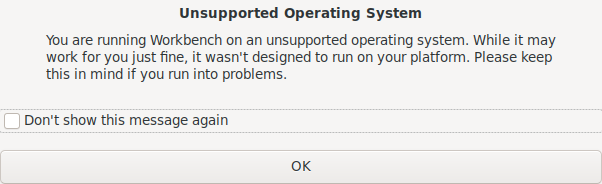

## NixOS

I had tried out [NixOS](https://nixos.org/download.html) around 4 to 5 years ago to see if I can use
it in one of my machines, but unfortunately there was a known driver
issue at that time. I have been trying it on VMs on and off in the
last couple of years and the experience has been okay, but I didn't
feel comfortable enough to use it for my day to day work.

About a year ago I started using plain nixpkgs in my Ubuntu
distribution to manage the software installation. Most of the packages
worked fine, except some packages like `xscreensaver`, `alacritty`
etc. This helped me understand nixpkgs better. I became comfortable
doing package overrides, managing my xmonad configuration via nixpkgs
etc.

Recently, my laptop got a motherboard upgrade and I decided to install
the latest Ubuntu LTS version. While everything seemed to be fine,
some of the dev dependencies caused issues. I was eventually able to
fix it, but then decided that this is probably a good time for me to
try out NixOS since it won't be having these kind of issues. This post
is my review of NixOS after using it for almost a year.

## My requirements

My requirements from an operating system would be:

- Easy to use.
- Good development platform for Haskell and Rust.
- Software for numerical computations like sagemath and octave.
- GUI softwares like gnucash, keepassxc, mysql-workbench etc.
- Easy availability of other softwares like latex, emacs, fish etc.

At a high level, it looked like NixOS might satisfy all these
requirements.

## Ease of Use

In my opinion, knowing Nix language and how nixpkgs is structured are
pre-requisites to use NixOS comfortably. Fortunately my previous
experience with functional languages helped me.

So I wouldn't recommend NixOS to non-programmers. Although, I believe
a project like [nix-gui](https://github.com/nix-gui/nix-gui) might simplify things in future.

## Installation experience

I went through the NixOS manual and downloaded the [minimal ISO
image](https://nixos.org/download.html). For Ubuntu distribution, I usually install using bootable
USB drives created through [unetbootin](https://unetbootin.github.io/). There was a note in [this
wiki](https://nixos.wiki/wiki/NixOS_Installation_Guide/Unetbootin) saying Unetbootin wasn't supported for NixOS. But I went
ahead and gave it a shot. The process seemed to be successful, but the
installation failed with no useful error message. I then did a fresh
format of the USB and used the `dd` utility to write the image. The
installation process worked fine after that.

Another thing which was surprising to me was that [secure boot](https://en.wikipedia.org/wiki/Unified_Extensible_Firmware_Interface#Secure_Boot) is
not yet possible via NixOS. I had to go and disable it in my
[BIOS](https://en.wikipedia.org/wiki/BIOS). That seems to be a [known upstream issue](https://github.com/NixOS/nixpkgs/issues/42127).

Overall, I believe the installation experience was fine. I guess if I
had used a Graphical ISO image instead of the minimal one, it would
have been easier.

## Development experience

#### Rust

I installed `rustup` globally and was able to easily do development
without any issues. For the packages which needed system libraries, I
could easily figure out the dependencies. For the [cnx](https://github.com/mjkillough/cnx) package, I
had to create a [shell.nix](https://github.com/mjkillough/cnx/blob/master/shell.nix) like this:

``` nix
with import <nixpkgs> { };
stdenv.mkDerivation {
  name = "cnx";
  buildInputs = [
    pkg-config
    alsaLib
    gobject-introspection
    cairo
    glib
    pango
    xorg.libxcb
    python3Full
    openssl
    wirelesstools
    libllvm
    clang
    libclang
    rust-bindgen
    llvmPackages.libclang
    xorg.libxcb
    xorg.xcbutilwm
  ];

  shellHook = ''
    export LIBCLANG_PATH="${llvmPackages.libclang.lib}/lib";
  '';
}
```

#### Haskell

Compared to Rust, with Haskell it was slightly more challenging. There
were two options:

- Using the nixpkgs infrastructure by itself
- [IOHK's Haskell infrastructure for nix](https://github.com/input-output-hk/haskell.nix)

I wanted to use [the Stack](http://haskellstack.org/) build tool since I was already familiar
with it and had a good experience using it. Since Stack doesn't manage
GHC in NixOS, this proved challenging to me as the compiler version I
wanted wasn't in the current nixpkgs package set.

Since `rustup` worked well, I installed `ghcup` and tried installing
the compiler through it. Unfortunately that didn't work. It downloaded
a Fedora based GHC for NixOS and failed during the installation. But
after looking around a bit, I was able to find the [Nix package
versions](https://lazamar.co.uk/nix-versions/) search page which can be used to find old versions of
different packages in nixpkgs revisions easily. And that solved my
problem of finding an older GHC version. Also, Cheng Shao at Zurihac
made this [repository](https://github.com/TerrorJack/old-ghc-nix) which list downs all the old GHC versions
from old nixpkgs revisions.

After the above problem was solved, I was able to use Stack build tool
for development work seamlessly.

## Other softwares

Most of the other softwares seemed to work. I didn't face any issue
with either docker, keepassxc or gnucash. But I faced an issue with
mysql-workbench. It initially greeted me with an unsupported OS
dialog:



And when I tried to connect a database, it errored out saying
`org.freedesktop.secrets` was not provided. I wasn't able to provide
it with the database credentials properly. I tried to switch to
[dbeaver](https://search.nixos.org/packages?channel=21.05&show=dbeaver&from=0&size=50&sort=relevance&query=dbeave) instead and fortunately it worked for me.

Also, one of the packages I was using for Emacs ([dumb-jump](https://github.com/jacktasia/dumb-jump/pull/400)) didn't
work. But I was able to easily create an [upstream fix](https://github.com/jacktasia/dumb-jump/pull/400) for
it. This was easy for me because other nix users had faced similar
issues for other Emacs packages. I wanted to try running the test suite
for the package locally based on [these instructions](https://github.com/jacktasia/dumb-jump/tree/542e72d3feba986a12119f6def515ef1347cb4ca#basicclassic):

``` sh
❯ cd <path_to_dumb_jump>
❯ cask
❯ make test
```

I have to execute `cask` and then do `make test`. I used `nix-shell`
to get `cask` executable available in the `$PATH`:

``` sh
❯ nix-shell -p cask
❯ cask
bash: /nix/store/bva3nw2nvcxlrqn24f90mnm2hb60hqxw-cask-0.8.7/bin/cask:
/bin/bash: bad interpreter: No such file or directory
```

The above error indicates that cask has some hard-coded paths
and it won't play nicely in NixOS without some fixes. So I thought I
would try fixing this later and just used the upstream CI service to
run the test suite instead.

One final issue which I found annoying was whenever I tried to run any
program which didn't exist in `$PATH`, I saw an error message like
this:

``` sh
❯ invalid_program
DBI connect('dbname=/nix/var/nix/profiles/per-user/root/channels/nixos/programs.sqlite','',...)
failed: unable to open database file at /run/current-system/sw/bin/command-not-found line 13.
cannot open database `/nix/var/nix/profiles/per-user/root/channels/nixos/programs.sqlite'
at /run/current-system/sw/bin/command-not-found line 13.
```

I solved it using [this discourse answer](https://discourse.nixos.org/t/command-not-found-unable-to-open-database/3807/4), but I hope that this
will be fixed soon.

## Upgrade

After I had used NixOS for a few months, a new version was
available. Upgrading to it was quite simple:

``` shellsession
❯ sudo nix-channel --add https://nixos.org/channels/nixos-21.11 nixos
❯ sudo nixos-rebuild switch --upgrade
```

After around 15 to 20 minutes, I had the newer version running:

Before:

``` shellsession
❯ nixos-version
21.05.4116.46251a79f75 (Okapi)
```

After:

``` shellsession
❯ nixos-version
21.11.334247.573095944e7 (Porcupine)
```

I found it nice that I have the ability to boot back into my previous
NixOS version in case something went wrong.

## Community

The community around NixOS seems to be quite active and the github
model makes it easy to contribute fixes. I was able to easily package
various softwares which I use and didn't find in nixpkgs:

- [tfswitch](https://github.com/NixOS/nixpkgs/pull/129346)
- [ouch](https://github.com/NixOS/nixpkgs/pull/131538)
- [amber](https://github.com/NixOS/nixpkgs/pull/138159)
- [tgswitch](https://github.com/NixOS/nixpkgs/pull/146501)
- [kubergrunt](https://github.com/NixOS/nixpkgs/pull/151509)

I also contributed to nixos-hardware for the machines which I'm using:

- [Dell latitude 7490](https://github.com/NixOS/nixos-hardware/pull/330)
- [Intel NUC 8i7BEH](https://github.com/NixOS/nixos-hardware/pull/343)

Both of the above patches enabled running [thermald](https://github.com/intel/thermal_daemon) by default for
the machines.

I also found the [Zurihac 2021](https://zfoh.ch/zurihac2021/) voice channel discussions quite
helpful. I would like to thank everyone who answered my questions and
also a special shout out to [Dennis](https://github.com/fakedata-haskell/fakedata-quickcheck/pull/5#issuecomment-864372669).

## Recommendation

If you are planning to switch to NixOS, my recommendation would be:

- Try to use nixpkgs in your existing Linux distribution to get
  familiar with it.
- Check if any software you rely on works fine using nix package
  set. There might be cases where the software might work on NixOS but
 not on other Linux distributions (using nixpkgs).
- Check if you are able to do your existing development work using
  nixpkgs.

NixOS has a come a long way since the last time I tried it
seriously. I'm now using NixOS exclusively on all my work and home
machines.
