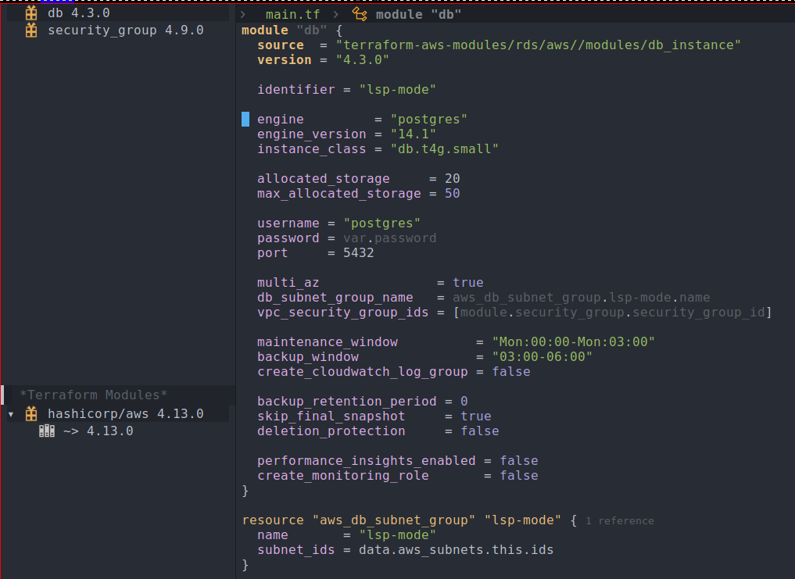

I have been working on improving the Terraform language support
for `lsp-mode`, that is, `lsp-terraform`. My goal is to ensure
feature parity with the official Visual Studio extension.

Currently, there are two language servers available for Terraform:

- [terraform-ls](https://github.com/hashicorp/terraform-ls)
- [terraform-lsp](https://github.com/juliosueiras/terraform-lsp)

All of my improvements were done targeting `terraform-ls` server which
is the official language server from HashiCorp. The above links
contain information about both the language servers and how they differ
from each other.

## New commands for validate and init operations

Two new commands were implemented for easily running validate and
init operations:

- lsp-terraform-ls-validate
- lsp-terraform-ls-init

#### lsp-terraform-ls-validate
`lsp-terraform-ls-validate` runs the [validate subcommand](https://www.terraform.io/cli/commands/validate)
on project root. All the violations detected are published back to
the buffer:


#### lsp-terraform-ls-init
`lsp-terraform-ls-init` runs the [init subcommand](https://www.terraform.io/cli/commands/init)
on the project root. Note that if your Terraform project requires
credentials, then you have to make sure that they are properly propagated.
I have been using Steve Purcell's [envrc](https://github.com/purcell/envrc)
package for this, and it has been working well for me. Note that this is a
synchronous operation and init takes quite a bit of time to complete.
If your Terraform project has a lot of dependencies, then it's
probably not a good idea to use this.

This is the [pull request](https://github.com/emacs-lsp/lsp-mode/pull/3509) which adds support
for the above commands.

## Support for References using Code Lens

This is a feature which has greatly improved my productivity. It's
best to demonstrate this feature using the following GIF:


Note that this is an experimental feature and should be enabled via
the option `lsp-terraform-ls-enable-show-reference`.

This is the [pull request](https://github.com/emacs-lsp/lsp-mode/pull/3524) which adds support for reference counts.

## Semantic tokens support

Using semantic tokens, you get additional contextual information for
your source code. Usually the syntax highlighting for your code is
done via major mode, and they are typically implemented via regular
expressions. While it's good for immediate instant feedback, using
semantic token additionally is nice as it gives you a good contextual
highlighting. This snapshot is before enabling semantic token:


And this is the same piece of code with semantic token:


One way to verify that your code is actually using semantic token is
to go to a piece of code and do `C-u M-x what-cursor-position`. It
will give you lots of detail but checking its [face](https://www.gnu.org/software/emacs/manual/html_node/emacs/Faces.html) will ensure
that it's using one defined by the lsp-semantic-tokens:

``` shellsession
There are text properties here:
  face                 lsp-face-semhl-label
  fontified            t
```

This is the [pull request](https://github.com/emacs-lsp/lsp-mode/pull/3535) for semantic tokens. I found
implementing this more involved as I had to touch both `lsp-mode.el`
and `semantic-tokens.el`. Most of my other changes just involved
extending the client code, but this involved understanding how various
pieces fit together.

There is also [this recent work](https://github.com/emacs-lsp/lsp-mode/pull/3680#issuecomment-1236039244) by Sebastian which will lead to
improvement in the way semantic tokens code is initialized by the
client. I'm looking forward to doing the relevant changes for the
terraform client once it's merged.

## Tree view controls

I have introduced a couple of functions that will allow you to visualize
 [providers](https://www.terraform.io/language/providers) and [module](https://www.terraform.io/language/modules) calls. I used [lsp-treemacs](https://github.com/emacs-lsp/lsp-treemacs.git) to provide
 the integration. This is how your Emacs frame will look with them:



To call the above widgets you have to use the following functions:

- lsp-terraform-ls-providers
- lsp-terraform-ls-module-calls

Corresponding pull requests for the same:

- [Providers integration](https://github.com/emacs-lsp/lsp-mode/pull/3537)
- [Module calls integration](https://github.com/emacs-lsp/lsp-mode/pull/3538)

## Improved documentation

Also, as part of the changes, I have written a separate user manual on
how to use `lsp-mode` effectively with Terraform. This is the [official documentation page](https://emacs-lsp.github.io/lsp-mode/page/lsp-terraform-ls/).

These are some of the documentation related pull requests:

- [Initial documentation](https://github.com/emacs-lsp/lsp-mode/pull/3522)
- [Revamp entire documentation for the terraform client](https://github.com/emacs-lsp/lsp-mode/pull/3540)
- [Update documentation for terraform-ls server](https://github.com/hashicorp/terraform-ls/pull/932)

## Future improvements

While I'm happy with current state of Terraform client in lsp-mode and
believe it's on-par with the Visual Studio Code experience, these are some
of the tasks which I'm planning to work on next:

- Tweak the semantic token faces for better contextual display.
- Better icon for treemacs widgets.
- Ability to refresh treemacs widgets.
- Test suite for Terraform client.

Also, I have been following the [releases of terraform-ls](https://github.com/hashicorp/terraform-ls/releases) and
implementing the additional features like [this pull request](https://github.com/emacs-lsp/lsp-mode/pull/3684) for making it compatible with the
new features provided by [terraform-ls v0.29.0](https://github.com/hashicorp/terraform-ls/releases/tag/v0.29.0). Although, most of the time I didn't have to
make any explicit changes as it's supported out of the box by lsp-mode.

That concludes my post on the various improvements made to the
Terraform client. Do try out the latest version! Open an issue if you
encounter any bugs or have suggestions for enhancements.
