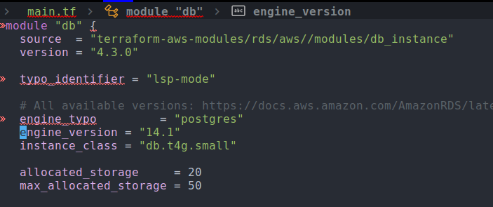
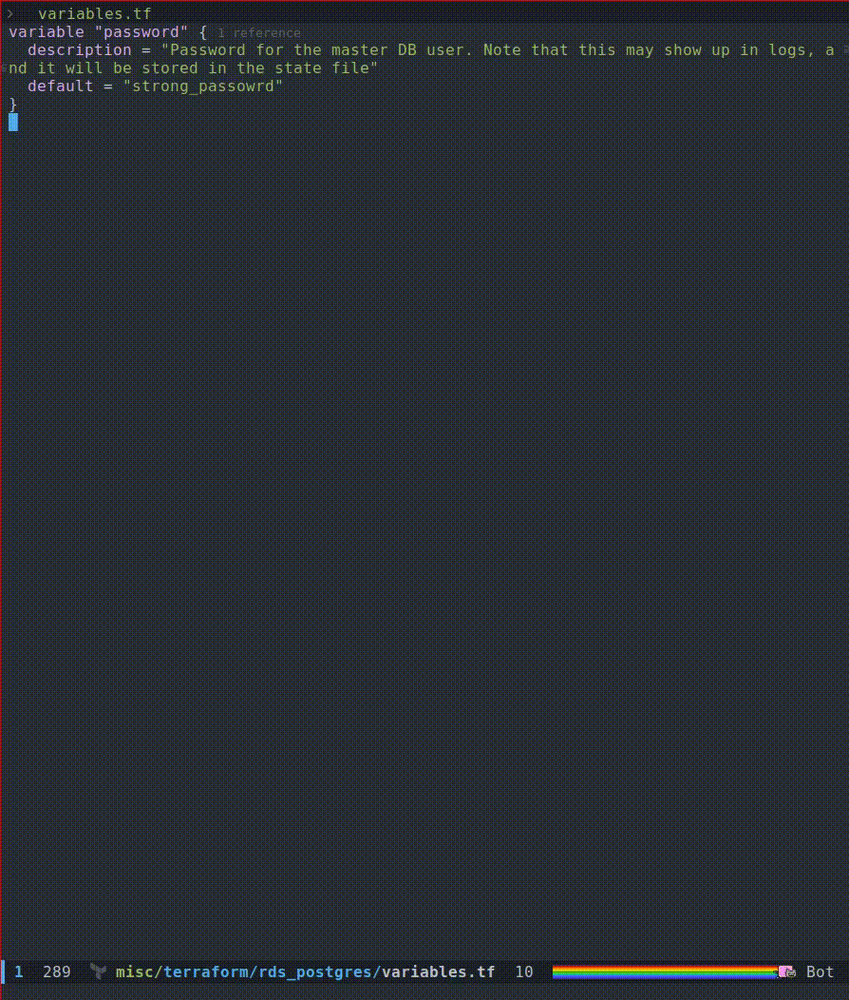
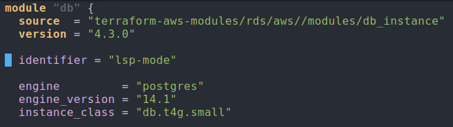

I have been working on improving the `lsp-mode` support for the
terraform language. My goal was to make it on par with the official
visual code extension.

This post will summarize the recent improvements which I have been
bringing to `lsp-terraform`.

Currently, there are two language servers available for terraform:

- [terraform-ls](https://github.com/hashicorp/terraform-ls)
- [terraform-lsp](https://github.com/juliosueiras/terraform-lsp)

The above links contain information about them and how they differ
from each other. In my case, all of my improvements were done
targeting `terraform-ls` server which is the official one from
Hashicorp.

## New commands

Two new commands were implemented for easily running validate and
init operations:

- lsp-terraform-ls-validate
- lsp-terraform-ls-init

`lsp-terraform-ls-validate` runs the [validate subcommand](https://www.terraform.io/cli/commands/validate) on
project root. All the violations that happens are published back in
the buffer:



`lsp-terraform-ls-init` runs the init subcommand on the project
root. Note that if your terraform project requires credentials, then
you have to make sure that they are properly progated. I have been
using Steve Purcell's [envrc](https://github.com/purcell/envrc) package for it and it has been
working good. Although do note that this is a synchronous operation
and init takes quite a bit of time to complete. If your terraform
project has quite a bit of dependencies, then it's probably not a good
idea to use this.

This is the [pull request](https://github.com/emacs-lsp/lsp-mode/pull/3509) which adds support for the above
commands.

## References support using Code Lens

This is a feature which has greatly improved my productivity. It's
best to demonstrate this feature using the GIF:



Note that this is an experimental feature and should be enabled via
the option `lsp-terraform-ls-enable-show-reference`.

This is the [pull request](https://github.com/emacs-lsp/lsp-mode/pull/3524) which adds support for reference counts.

## Semantic tokens support

Using semantic tokens, you get additional color information for your
source code. Usually the syntax highlighting for your code is done
major done and they are typically implemented via regex. While it's
good for immediate instant feedback, using semantic token is nice as
it gives you a good contextual highlighting. This snapshot is before
enabling semantic token:


And this is the same piece of code with semantic token:



One way to verify that your code is actually using semantic token is
to go to a piece of code and do `C-u M-x what-cursor-position`. It
will give you lots of detail but checking it's [Face](https://www.gnu.org/software/emacs/manual/html_node/emacs/Faces.html) will ensure
that it's using one defined by the lsp-semantic-tokens:

``` shellsession
There are text properties here:
  face                 lsp-face-semhl-label
  fontified            t
```

This is the [PR](https://github.com/emacs-lsp/lsp-mode/pull/3535) supporting semantic token support. I found
implementing this more involved as involved touching both
`lsp-mode.el` as well as `semantic-tokens.el`. Most of my other
changes just involved extending the client code, but this involved
understanding how various pieces fit together.

## Treeview controls


## Improved documentation
