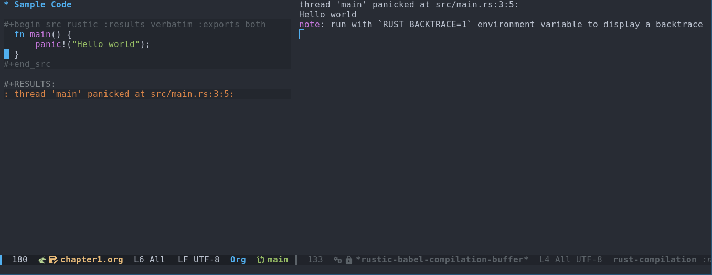

[Rustic](https://github.com/emacs-rustic/rustic) is a major mode Emacs that simplifies Rust development. It
builds upon the foundation of [rust-mode](https://github.com/rust-lang/rust-mode) and offers additional
features.

Rustic's integration with [Org Babel](https://orgmode.org/worg/org-contrib/babel/) allows you to embed Rust code
snippets directly within your Org buffers. This enables you to execute
the code and view the results without leaving your editor,
streamlining your workflow.

This makes it quite useful for literate programming, interactive
development; and for scripting, which I use extensively at my work.

## Basic workflow

- Open a new org file
- Create a source block and include your snippet:

``` rust
#+begin_src rustic :results verbatim :exports both
  fn main() {
      println!("Hello world");
  }
#+end_src
```

- Execute the code by pressing `Ctrl-C Ctrl-c`.

The results from the code execution will be displayed within a
dedicated result block below the source code:

``` org
#+RESULTS:
: Hello world
```

You can edit the code and re-execute it using Ctrl-C Ctrl-C. The
results block will update automatically, reflecting the changes.


# Handling Panics and Errors

The aforementioned workflow is efficient until you encounter panics or
compilation errors in your code. Let's explore how Rustic handles
these scenarios.

## Scenario one: Panics

``` rust
#+begin_src rustic :results verbatim :exports both
  fn main() {
      panic!("Hello world");
  }
#+end_src
```

Executing this code with a panic will produce the following results:

``` org
#+RESULTS:
: thread 'main' panicked at src/main.rs:3:5:
```

Additionally, a new popup buffer will appear displaying the full error
message:

``` shellsession
thread 'main' panicked at src/main.rs:3:5:
Hello world
note: run with `RUST_BACKTRACE=1` environment variable to display a backtrace
```

Snapshot of my editor showing this scenario:



## Scenario two: Compilation errors

If you introduce a compilation error, the results block will have very
limited information:

``` rust
#+begin_src rustic :results verbatim :exports both
  fn main() {
      panic("Hello world");
  }
#+end_src

#+RESULTS:
: error: Could not compile `cargoyacVpM`.
```

The popup buffer, however, would contain more details about the error.

# Desired behaviour

I preferred and subsequently implemented the following behavior:

- Consolidate all output, including error messages, within the results
  block.
- Eliminate disruptive popup buffers.

To maintain backward compatibility, a customizable variable named
*rustic-babel-display-error-popup* has been introduced in Rustic. By
default, it's set to `t` (true), which preserves the current
behavior. To enable the new behavior with consolidated output in the
results block and no popups, simply set this variable to `nil`
(false).

Here's what the results block would look like after enabling the new
behavior and re-executing the code with a compilation error:

``` rust
#+begin_src rustic :results verbatim :exports both
  fn main() {
      panic("Hello world");
  }
#+end_src

#+RESULTS:
#+begin_example
error[E0423]: expected function, found macro `panic`
 --> src/main.rs:3:5
  |
3 |     panic("Hello world");
  |     ^^^^^ not a function
  |
help: use `!` to invoke the macro
  |
3 |     panic!("Hello world");
  |          +
help: consider importing this function instead
  |
2 + use core::panicking::panic;
  |

For more information about this error, try `rustc --explain E0423`.
error: could not compile `cargoyacVpM` (bin "cargoyacVpM") due to 1 previous error
#+end_example
```

This behavior was implemented in Emacs-rustic through the following
pull requests:

- [PR 25: Ability to include compilation failure, panic as part of org result block](https://github.com/emacs-rustic/rustic/pull/25)
- [PR 27: Add compilation special case](https://github.com/emacs-rustic/rustic/pull/27)

This approach provides a cleaner and less intrusive experience while
providing information about errors.
