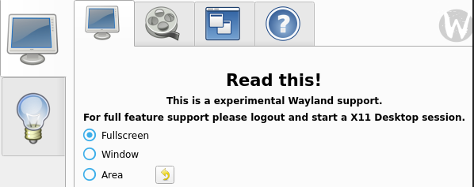
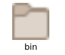
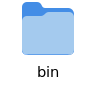

This post describes my experience of moving to a Wayland based
compositor. Alternatively, this post could have been titled **Moving
from XMonad**, as that's what I've been using for over a decade.

I've been using Wayland with the described setup for around seven
months now.

## Why ?

It's been well-known for quite some time that X11 server development
has [slowed
down](https://www.phoronix.com/news/XServer-2022-Development-Pace), with
most of the Linux desktop world converging on Wayland-based compositors.

However, what truly motivated me to switch was a [recent
post](https://xmonad.org/news/2023/10/06/wayland.html) from the XMonad
team seeking someone to add Wayland support. More specifically, this
message from Brandon S Allbery on his discourse.haskell.org [forum
post](https://discourse.haskell.org/t/xmonad-for-wayland-call-for-help/7812/5)
resonated with me. He answered a question about why someone would want
to move from X11:

<blockquote class="blockquote" style="line-height: 2rem; font-weight: bold">
Mostly that X11's days are numbered (although I expect it to last at
least until 2030 due to Red Hat's contractual obligations). But video
drivers are already starting to become less reliable as chipset
manufacturers refocus on Wayland instead of X11. This is already
affecting games and other programs which are becoming more stable under
Wayland than X11.
</blockquote>

## Requirements

Given that I have been using XMonad, I needed an equivalent tiling-based
Wayland compositor.

These are some of the other software programs I use:

-   Rofi for application launcher
-   VokoScreen for screen recording
-   Screen sharing in a browser
-   Scripts relying on xsel, xclip, etc.
-   Cnx status bar
-   emacs-everywhere
-   Thunar file manager
-   Emacs
-   xfce4-screenshooter for snapshots

My requirement is that either the above software functions as before or
I would need an equivalent alternative for my day-to-day usage.

Since I have been using NixOS, the overall process of moving to a
different environment was declarative, using a combination of editing
`configuration.nix` and the home-manager configuration file.

### Application launcher (Rofi)

Rofi is the application launcher I use.

There is a fork of [rofi](https://github.com/lbonn/rofi) available for
wayland. Installing it was straightforward, and it has been working well
enough for me.

### Screen casting (vokoscreen)

I used Vokoscreen for screencasting, but unfortunately, it doesn't
support Wayland.

There's [VokoscreenNG](https://github.com/vkohaupt/vokoscreenNG), which
has experimental Wayland support. However, when I tried it, it didn't
work well enough. They do warn about the experimental Wayland support
when you start it up:



I wanted something lightweight, so I wasn't interested in using OBS
Studio. Finally, I found [kooha](https://github.com/SeaDve/Kooha), which
works well enough for my use cases.

### Browser Screen sharing

Getting reliable screen sharing to work in Google Chrome was the most
challenging part of migrating to Wayland. I wouldn't even consider the
support stable yet, as the integration can break after every system
update.

The xdg-portal is a key component for securely accessing resources.
Home-manager added support for it [last
year](https://github.com/nix-community/home-manager/pull/4707), which
definitely helped.

However, screen sharing stopped working after a recent system update.
When I tried to share my screen, my browser crashed. As a temporary
solution, I've switched to Chromium, where screen sharing works fine.

I considered trying Firefox, but it doesn't seem to allow sharing
individual tabs, which is a feature I use in Chromium.

### Terminal Multiplexer (GNU screen)

I've been using GNU Screen as my terminal multiplexer. I had a [custom
configuration](https://github.com/psibi/dotfiles/blob/master/.screenrc)
for it, including some Wayland-based clipboard fixes. Unfortunately,
this configuration didn't work well when I switched to Wayland.

I'd been looking for a modern alternative for a while. I previously
experimented with zellij, but it was quite buggy at the time. However, I
recently gave it another try and switched permanently. Here's what I
like about Zellij:

-   Easy command discovery
-   Much better defaults
-   The ability to easily open the entire session in my \$EDITOR

However, there's one feature I miss from GNU Screen: keyboard-based
copying. Thankfully, there's an open [upstream
issue](https://github.com/zellij-org/zellij/issues/947) about it zellij
copy paste issue, so hopefully it gets fixed soon.

### Status bar

I was using the [cnx](https://docs.rs/cnx/latest/cnx/) status bar and
even became one of its maintainers. Unfortunately, cnx doesn't
currently support Wayland and I don't foresee support coming in the
near future unless someone else takes over development.

I've switched to
[i3status-rs](https://github.com/greshake/i3status-rust), which is a
great alternative. It provides all the widget support I need.

### File manager

I was using the [Thunar](https://docs.xfce.org/xfce/thunar/start) file
manager, which according to the XFCE
[documentation](https://wiki.xfce.org/releng/wayland_roadmap) supports
Wayland. However, I encountered some issues with icon rendering:



To fix this, I had to install the adwaita-icon-theme package:



### emacs

Emacs offers a PGTK (pure GTK) backend, which works seamlessly on
Wayland. I haven't encountered any problems yet

### emacs-everywhere

[emacs-everywhere](https://github.com/psibi/emacs-everywhere) is my fork
of emacs-anywhere. I mostly use it to inject my passwords into banking
sites which don't work well with KeepassXC browser extension. This was
a minor change to make it work with Wayland, and I was surprised at how
easy it was to get it working:

``` diff
- window="$( xdotool getactivewindow || xdotool getwindowfocus )"
-
- $HOME/.emacs_everywhere/bin/emacstask
-
- xdotool windowfocus --sync $window
-
- xdotool type --clearmodifiers --delay 1 "$clipboard"
+ wtype -d 1 "$clipboard"
```

### Snapshots (xfce4-screenshooter)

I switched from xfce4-screenshooter to
[Flameshot](https://github.com/flameshot-org/flameshot) because its UI
is much nicer. However, I'm encountering some issues with it in Sway.
There's an open Nixpkgs
[issue](https://github.com/NixOS/nixpkgs/issues/292700) about this. As a
temporary workaround, I'm currently using an [unreleased
version](https://github.com/NixOS/nixpkgs/issues/292700#issuecomment-1974953531).

If I ever return to X11, I'll definitely stick with Flameshot.

## Comparsion with XMonad

XMonad would still be my choice if I were using X11. Sway is stable, and
I was easily able to configure it to adapt to my workflows.

One key difference is that I don't have to compile things anymore. With
XMonad, I had to use GHC to compile my Haskell code to produce an
executable. With Sway, it's just a configuration, and I much prefer
this workflow.

## X11 vs Wayland

I haven't noticed any functional differences between the two, probably
because I don't play games. That's where [screen
tearing](https://en.wikipedia.org/wiki/Screen_tearing) issues tend to be
more prominent for other users.

Based on my experience, Wayland still feels like a maturing technology.
